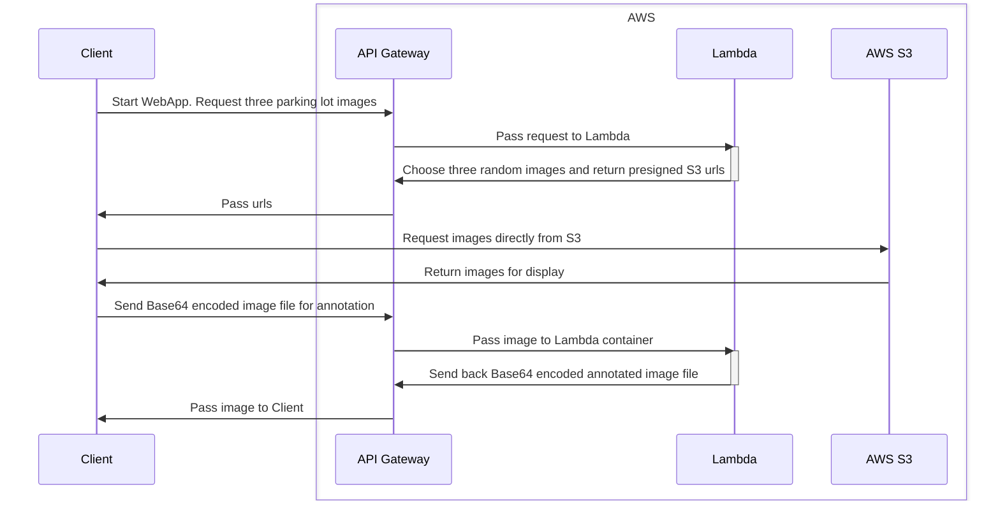

# Parking Lot Spot Detection

### Design

```mermaid
  sequenceDiagram
    participant C as Client
    box AWS
    participant Api as API Gateway
    participant Lambda as Lambda
    participant S3 as AWS S3
    end
    C->>Api: Start WebApp.  Request three parking lot images
    Api->>Lambda: Pass request to Lambda
    activate Lambda
    Lambda->>Api: Choose three random images and return presigned S3 urls
    deactivate Lambda
    Api->>C: Pass urls
    C->>S3: Request images directly from S3
    S3->>C: Return images for display
    C->>Api: Send Base64 encoded image file for annotation
    Api->>Lambda: Pass image to Lambda container
    activate Lambda
    Lambda->>Api: Send back Base64 encoded annotated image file
    deactivate Lambda
    Api->>C: Pass image to Client
```
